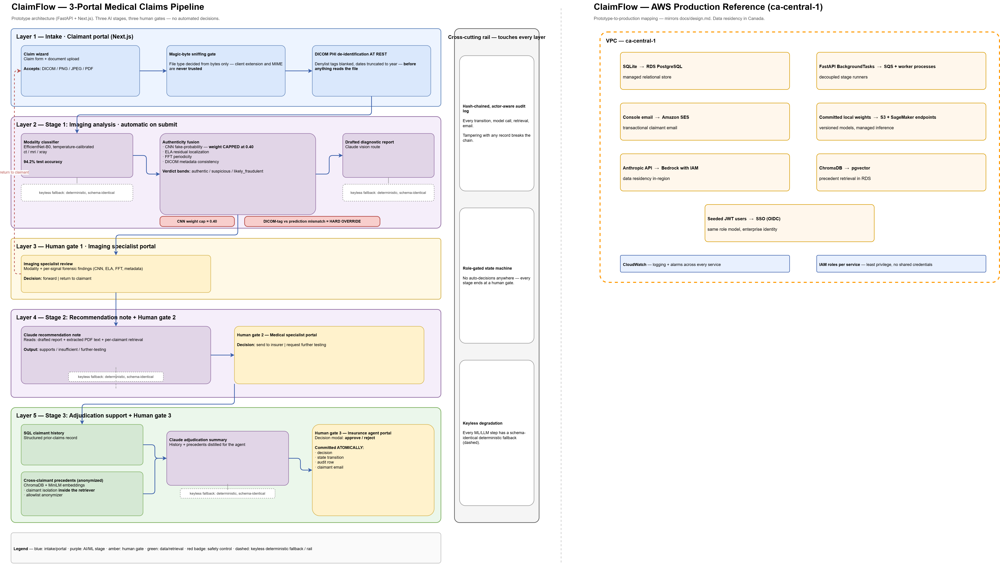
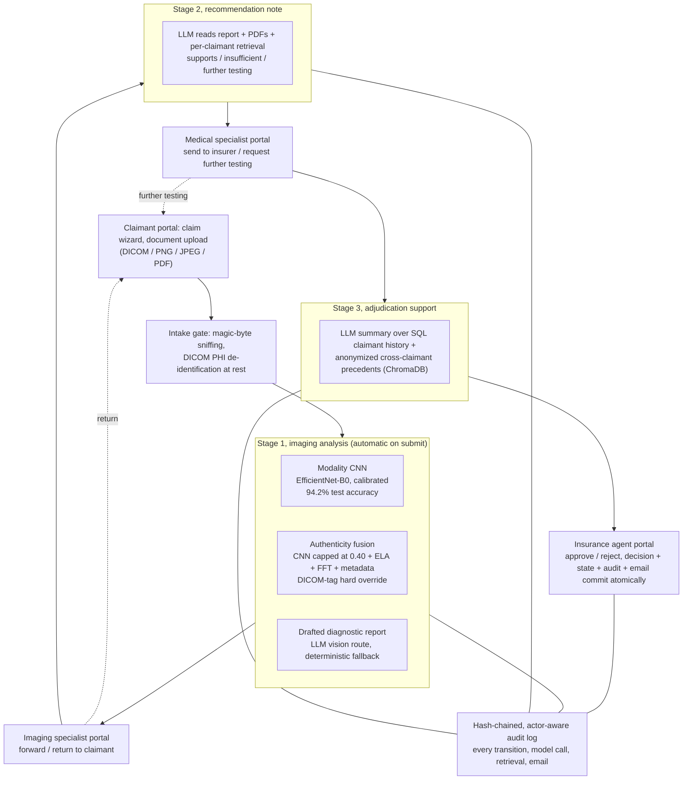
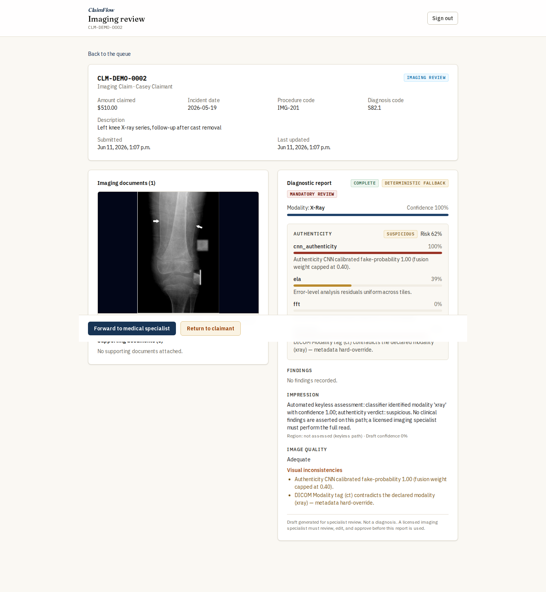
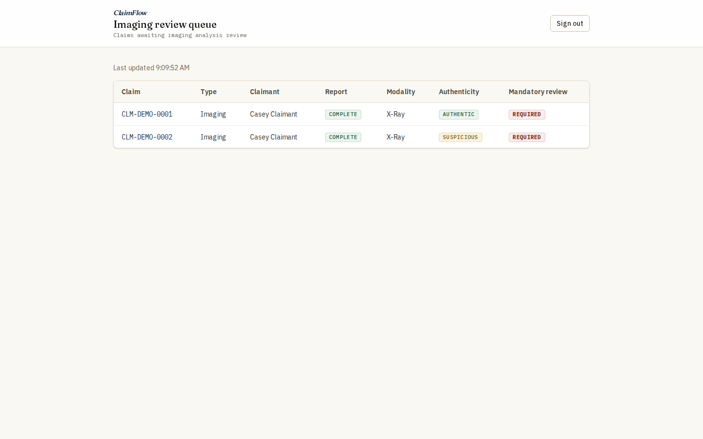
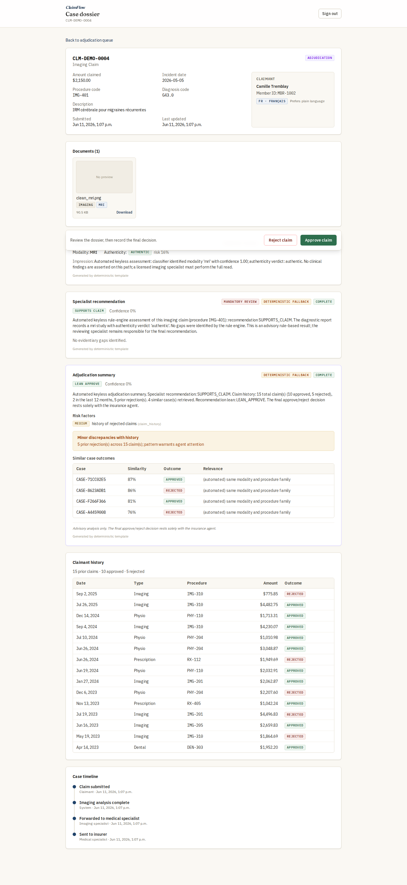
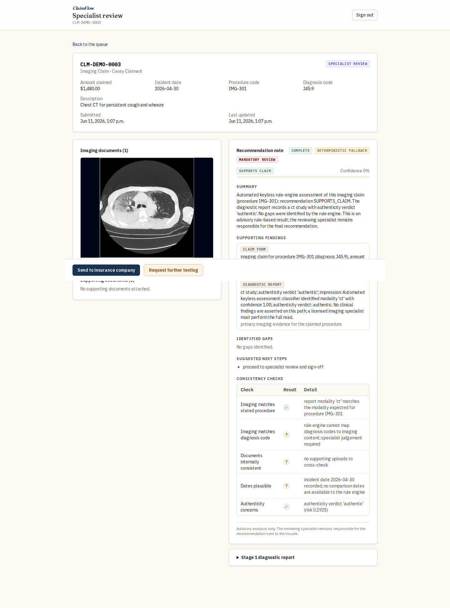
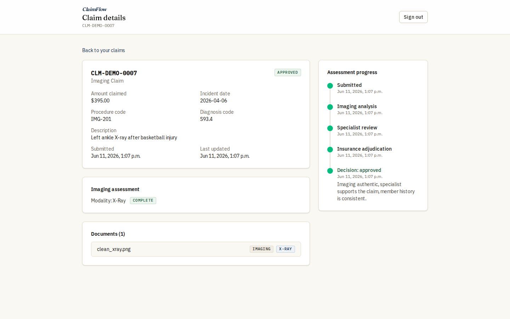
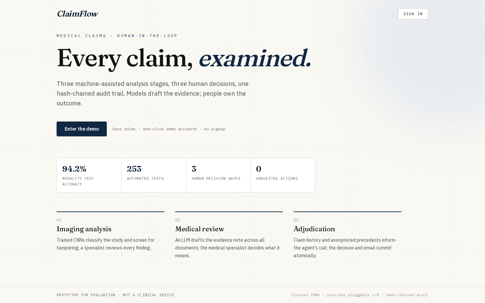
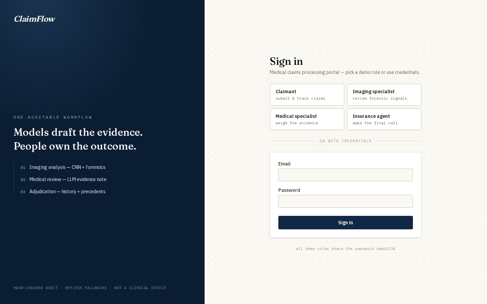

# ClaimFlow

**Live demo:** [claimflow-demo.vercel.app](https://claimflow-demo.vercel.app) (one-click demo roles) · API: [minifigures-claimflow-api.hf.space/docs](https://minifigures-claimflow-api.hf.space/docs)

A human-in-the-loop medical insurance claims prototype: three review portals, three ML-assisted analysis stages, one auditable workflow. Claimants submit imaging claims (X-ray / CT / MRI); an imaging specialist, a medical specialist, and an insurance agent each review machine-generated analysis before any decision is made. The final decision dispatches the claimant's notification email atomically.

## How it works





Every workflow transition, model call, retrieval, and email is recorded in a hash-chained, actor-aware audit log; tampering with any record (including *who* acted) breaks the chain.

## Quickstart

```bash
cp .env.example .env
docker compose up --build      # or: make demo
# frontend http://localhost:3000 — backend API http://localhost:8000
```

Runs fully **keyless** by default: the imaging CNNs are local trained weights (no API involved), every LLM stage degrades to deterministic, schema-identical fallbacks, and email is logged to the console provider and surfaced in the UI. Set `ANTHROPIC_API_KEY` (Claude stage routing in `backend/app/llm/routing.py`) or `GEMINI_API_KEY` (free-tier lane) in `.env` for live LLM analysis; the provider layer is pluggable behind one client.

| Portal | Login | Password |
|---|---|---|
| Claimant | `claimant@demo.ca` | `demo1234` |
| Imaging specialist | `imaging@demo.ca` | `demo1234` |
| Medical specialist | `specialist@demo.ca` | `demo1234` |
| Insurance agent | `agent@demo.ca` | `demo1234` |

Demo data is pre-seeded with a claim parked at every workflow stage — including a tampered X-ray with per-signal forensic findings, and a French-language claimant so the decision modal drafts a bilingual notification.

Without Docker: `make install && make seed && make dev-api` and `make dev-web` (Node 20+, Python 3.11+, uv).

## What's real

- **Modality classifier**: EfficientNet-B0 fine-tuned on 15,000 ROCOv2 radiology images (5,000/class, CUI-derived labels), temperature-calibrated — **94.2% test accuracy, ECE 0.016**. Trained weights ship in `backend/weights/` and serve by default (`MODEL_BACKEND=real`); `stub` remains the dependency-free fallback.
- **Authenticity layer**: deterministic forensics (metadata/DICOM consistency, ELA, frequency, copy-move) fused with a CNN trained on generated tampering — capped so non-ML evidence can always override the model. Honest numbers and caveats in [docs/model-choices.md](docs/model-choices.md) and the model cards under `backend/ml_training/cards/`.
- **LLM stages**: provider-pluggable behind one client — Claude routing (Sonnet vision / Opus reasoning / Haiku drafting) as primary, a Gemini free-tier lane powering the hosted demo, identical structured outputs, stop-reason guardrails, per-call cost audit, and prompt-injection defenses for claimant-uploaded documents. Both degrade to deterministic, schema-identical fallbacks.
- **Retrieval**: per-claimant document search with isolation enforced inside the retriever, plus cross-claimant precedent retrieval through an allowlist anonymizer.

## Screenshots

The demo star: a deliberately tampered X-ray (copy-move + splice on a real radiograph, wrapped in a DICOM whose Modality tag contradicts the declared modality) caught by the fusion and routed to mandatory human review.



| | |
|---|---|
|  |  |
|  |  |
|  |  |

## Requirements traceability

| Brief requirement | Implementation | Verified by |
|---|---|---|
| Claim intake with imaging (X-ray / CT / MRI) | Claimant portal (`/claimant`) wizard; `POST /api/claims`, `POST /api/documents/upload/{claim_id}` — magic-byte sniffing, DICOM PHI de-identification at rest, safe-metadata allowlist | `test_claims.py`, `test_documents.py` |
| §1 ML analyzes the image by type and generates a structured diagnostic report | Stage-1 pipeline (`app/services/inference_runner.py`): modality CNN + authenticity fusion (`app/ml/imaging/real.py`, stub fallback) + drafted report (`app/llm/`) | `test_inference_runner.py`, `test_real_analyzer.py`, `test_llm_documents.py` |
| §1 responsible specialist reviews, forwards or returns | Imaging portal (`/imaging`); `GET /api/specialist/queue`, `POST .../forward`, `POST .../return` | `test_specialist_flow.py` |
| §2 ML reads all submitted documents and generates a recommendation note (supports / insufficient / further testing) | Stage-2 runner over imaging report + extracted PDF text + per-claimant retrieval; `POST /api/specialist/cases/{id}/regenerate` | `test_llm_stages.py`, `test_rag.py` |
| §2 specialist sends the package to the insurance company | Medical portal (`/specialist`); `POST .../send-to-insurer`, `POST .../request-further-testing` | `test_specialist_flow.py` |
| §3 ML summarizes note + report + claimant history from the database | Stage-3 adjudication summary: SQL claimant history + anonymized cross-claimant precedents (Chroma); agent dossier `GET /api/agent/cases/{claim_id}` | `test_agent_flow.py`, `test_rag.py` |
| §3 agent decides; system immediately emails the claimant | Agent portal (`/agent`) decision modal; `POST /api/agent/cases/{id}/decision` — decision, state transition, audit row, and email dispatch commit atomically | `test_agent_flow.py`, `test_notifications.py` |
| Identify the model type for each ML step and justify it | [docs/model-choices.md](docs/model-choices.md) — per-stage selection, rationale, cost and governance mapping | — |
| Mocked outputs acceptable | Exceeded: trained CNNs + live LLM path; keyless mode serves deterministic, schema-identical fallbacks so the full flow demos with zero keys | `test_llm_fallbacks.py` |
| Humans stay in the loop for final decisions | State machine permits no auto-decision: every transition is a role-gated human action on machine-drafted evidence, recorded in the hash-chained audit log | `test_state_machine.py`, `test_audit.py` |

## Docs

- [docs/design.md](docs/design.md) — architecture, state machine, sequence diagrams, production path
- [docs/model-choices.md](docs/model-choices.md) — per-stage model selections and rationale, governance mapping, cost table
- Training pipeline: `backend/ml_training/` (`build_datasets`, `train_modality`, `train_authenticity`, `evaluate`, Colab notebook)

## Tests

```bash
make test   # backend: pytest (state machine matrix, audit tamper, PII guards,
            # injection cases, real-CNN serving path, full lifecycle E2E) — 253 tests
make lint
cd frontend && npx tsc --noEmit && npm run build
```

## Stack

FastAPI · SQLAlchemy 2 / SQLite (Postgres-ready) · Next.js App Router / TypeScript strict · PyTorch + timm · ChromaDB + sentence-transformers · Anthropic + Gemini APIs behind one provider-pluggable LLM client (Bedrock as the documented production path) · Docker Compose demo, deployed on Vercel + Hugging Face Spaces
