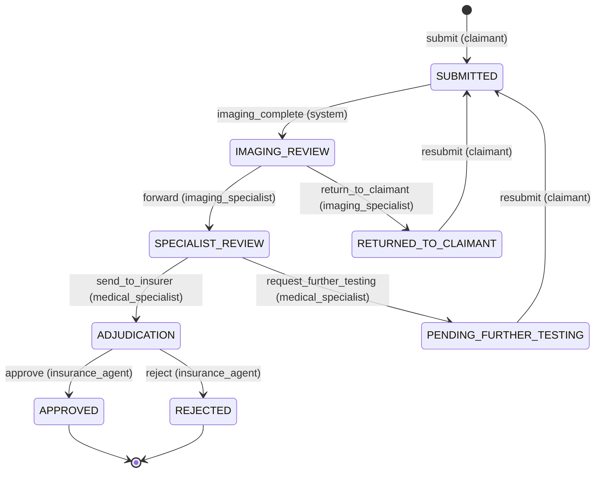

# ClaimFlow Design

ClaimFlow is a three-stage, human-in-the-loop medical claims prototype: imaging analysis, medical specialist review, and insurance adjudication, each assisted by an ML/LLM step and each gated by a human decision. The system is a Next.js (App Router, TypeScript strict) frontend over a FastAPI backend, with SQLite, ChromaDB, trained CNN weights, and live Anthropic model calls; every ML step degrades to a deterministic fallback so the full lifecycle runs keyless. Model selection rationale lives in [model-choices.md](model-choices.md); this document covers the architecture.

## Design principles

1. **The state machine is the single source of truth.** Every claim movement goes through one transition table; routers cannot invent transitions.
2. **Humans decide, models assist.** No model output ever moves a claim. The system performs exactly one autonomous transition (marking imaging analysis complete), and that only queues work for a human.
3. **Everything is audited.** Transitions, model calls, retrievals, emails, and logins append to a hash-chained log with the actor inside the record hash.
4. **Degrade, never crash.** Missing API key, missing weights, refused or truncated model calls, and failed deliveries all land in explicit, visible degraded states.

## Claim state machine

The transition table in `backend/app/workflow/state_machine.py` (`TRANSITIONS`) is the complete set of legal moves; each entry names the action and the only roles allowed to perform it. The diagram below is that table, exactly.



APPROVED and REJECTED are terminal; the state machine rejects any action on a terminal claim. Claimant actions additionally verify ownership (only the claim's claimant may resubmit it). Every applied transition writes a `Decision` row and a `workflow.transition` audit event inside the same transaction, emitted by the state machine itself rather than by per-router discipline.

## One claim, end to end

```mermaid
sequenceDiagram
    actor C as Claimant
    actor IS as Imaging specialist
    actor MS as Medical specialist
    actor IA as Insurance agent
    participant API as FastAPI routers
    participant BG as Background runners
    participant ML as Imaging analyzer
    participant LLM as LLM client
    participant DB as SQLite + audit chain
    participant V as ChromaDB

    C->>API: submit claim + upload imaging/PDFs
    API->>DB: claim SUBMITTED, DiagnosticReport PENDING
    API-->>BG: schedule_stage1
    BG->>ML: analyze image (CNN + forensics, 30s timeout)
    BG->>LLM: stage-1c report draft (sonnet vision) or fallback
    BG->>DB: report COMPLETE; imaging_complete -> IMAGING_REVIEW
    IS->>API: poll artifact, review split view
    IS->>API: forward
    API->>DB: -> SPECIALIST_REVIEW, RecommendationNote PENDING
    API-->>BG: schedule_stage2
    BG->>V: extract + index claim PDFs (per-claimant)
    BG->>LLM: stage-2 note (opus, thinking) or rule engine
    BG->>DB: note COMPLETE
    MS->>API: review, send_to_insurer
    API->>DB: -> ADJUDICATION, AdjudicationSummary PENDING
    API-->>BG: schedule_stage3
    BG->>DB: SQL claim history (all rows, exact)
    BG->>V: precedent + claimant-doc retrieval (audited)
    BG->>LLM: stage-3 summary (opus, thinking) or fallback
    BG->>DB: summary COMPLETE
    IA->>API: draft decision email (haiku or template)
    IA->>API: decision (approve/reject + edited email)
    API->>DB: transition + Decision + audit + Notification, ONE commit
    API->>V: index anonymized precedent (best-effort)
    API-->>C: notification email (console/SMTP provider)
```

The decision endpoint (`decide_claim` in `backend/app/routers/agent.py`) is deliberately atomic: the workflow transition, the Decision row, the decision audit event, and the Notification row land in a single transaction with one commit. A test asserts no terminal state exists without a Notification. The only piece outside the transaction is Chroma precedent indexing, which is best-effort and can never fail a decision.

## Roles

| Role | Portal | Acts at |
|---|---|---|
| claimant | `/claimant` (wizard, timeline, resubmission) | SUBMITTED, RETURNED_TO_CLAIMANT, PENDING_FURTHER_TESTING |
| imaging_specialist | `/imaging` | IMAGING_REVIEW (forward / return) |
| medical_specialist | `/specialist` | SPECIALIST_REVIEW (send to insurer / request testing) |
| insurance_agent | `/agent` | ADJUDICATION (approve / reject + notify) |

We split imaging specialist and medical specialist into distinct roles rather than one "specialist" because the assessment names them as distinct stakeholders with different judgments: the imaging specialist owns the read of the image and the diagnostic report (stage 1), the medical specialist owns whether the total evidence supports the claim (stage 2). The split is enforced in the state machine itself (forward/return are imaging_specialist-only, send_to_insurer/request_further_testing are medical_specialist-only), so a route bug cannot collapse the two review gates into one. The two reviewer portals share UI components but are role-gated end to end (JWT role claim, FastAPI `require_role`, Next.js middleware).

## Artifact status vs workflow state

These are two separate axes, on purpose. The claim's workflow state (where it sits in the human pipeline) lives on the claim and only moves through the state machine. Each ML artifact (DiagnosticReport, RecommendationNote, AdjudicationSummary) carries its own status: `pending -> running -> complete | failed` (`ArtifactStatus` in `backend/app/models/enums.py`). A claim in SPECIALIST_REVIEW with a failed recommendation note is a perfectly representable situation: the human queue position is unchanged, the artifact panel shows the failure and a regenerate button, and the reviewer can proceed on the documents alone if they choose. Frontend queues poll artifact status; workflow state changes only when a human acts (or on the one system transition). Artifacts also record provenance fields, `generated_by`, `prompt_version`, `fallback_reason`, and `requires_mandatory_review`, which render as badges in every portal.

## Module map

Backend (`backend/app/`):

| Package | Responsibility |
|---|---|
| `auth/` | bcrypt passwords, HS256 JWT in an httpOnly cookie, role guards, origin enforcement (`deps.py`) |
| `workflow/` | the transition table and `apply_transition` (`state_machine.py`) |
| `claimguard/` | hash-chained actor-aware audit log (`audit.py`), adapted from our earlier ClaimGuard POC |
| `models/` | SQLAlchemy entities, artifact tables, enums, history records |
| `routers/` | `auth`, `claims`, `documents` (upload + preview), `specialist` (both reviewer roles), `agent` (dossier + atomic decision) |
| `services/` | streamed UUID-named upload storage (`storage.py`), DICOM de-id + preview (`dicom_preview.py`), background stage runners (`inference_runner.py`), notification providers (console/SMTP) |
| `ml/` | the `ImagingAnalyzer` protocol and backend selection (`base.py`), deterministic stub (`imaging/stub.py`), real CNN+forensics backend behind `MODEL_BACKEND=real` |
| `llm/` | per-stage routing and pricing (`routing.py`), guarded client (`client.py`), deterministic fallbacks (`fallbacks.py`), untrusted-content wrapping and bundle assembly (`documents.py`), versioned prompts (`prompts/`), stage wiring (`stages/`) |
| `rag/` | vendored-model embedder, cosine Chroma collections, indexer, isolation-enforcing retriever, precedent anonymizer |

Training (`backend/ml_training/`): dataset probe and builders (`datasets/`), tampering generator (`datasets/tampering.py`), shared training loop + calibration (`models/`), `train_modality.py`, `train_authenticity.py`, `evaluate.py` (reproduces model-card metrics from committed weights).

Frontend (`frontend/src/app/`): `login` (four "sign in as" entry points), `claimant` (submission wizard, claim timeline, notifications), `imaging` (queue + image/report split view), `specialist` (queue + evidence and note view), `agent` (queue, full dossier, decision modal with editable email draft).

## Production path

The prototype makes deliberately small infrastructure choices with a named production replacement for each:

| Prototype | Production | Notes |
|---|---|---|
| SQLite (WAL, busy timeout) | PostgreSQL | SQLAlchemy 2.0 throughout; enums stored as plain strings for portability |
| FastAPI BackgroundTasks | SQS + worker processes | runner contract is already queue-shaped: own session, status walk, never raises |
| Console email provider | Amazon SES | provider interface in `services/notifications/`; status semantics already model logged/sent/failed |
| Local committed weights | S3 + SageMaker endpoints | serving config (classes, normalization, temperature) already externalized as JSON next to weights |
| Anthropic API key | Bedrock with IAM, ca-central-1 | routing layer isolates the swap to one client |
| ChromaDB (local, persistent) | pgvector or LanceDB | embeddings always passed explicitly, so the store is swappable |
| Seeded users + JWT cookie | SSO (OIDC) + the same role model | role enforcement lives in the state machine and deps, not the identity provider |

### Where Redis and Kafka would slot in (and why they are not in the prototype)

The stage runners are already queue-shaped (own session, status walk, never raise), so the broker is a swappable detail. SQS is the named production choice because it is managed, at-least-once, and zero-ops; a self-hosted **Redis** broker (arq/RQ) is the right call only when sub-second dispatch latency or an existing Redis (sessions, rate limiting, idempotency keys for the decision endpoint) justifies operating it. **Kafka** earns its place one step later, at the event-streaming tier: the hash-chained audit log is an event stream in disguise, and in production each audit append would also publish to a `claim-events` topic feeding fraud analytics, SLA dashboards, and model-drift monitors without touching the transactional path. Neither belongs in a reviewer-run prototype: two more stateful services in `docker compose` means two more ways `make demo` fails on a machine we do not control, and the runner contract already proves the architectural seam they would occupy.

## Failure handling

- **Orphan recovery.** Artifacts stuck in `running` after a crash are marked failed at startup (`recover_orphans` in `backend/app/services/inference_runner.py`, wired into the FastAPI lifespan in `backend/app/main.py`), with the reason preserved on the row.
- **Regenerate.** Failed artifacts expose a regenerate action (`backend/app/routers/specialist.py`); only failed runs regenerate, so a reviewer cannot re-roll a completed analysis.
- **LLM degradation.** The client (`backend/app/llm/client.py`) branches on stop_reason: refusals fall back and force mandatory review; truncation gets one doubled-budget retry (capped 16K) then falls back with a visible reason. Every route has a schema-identical deterministic fallback, so the keyless demo and the worst keyed failure share one code path.
- **Hostile or broken inputs.** Image analysis runs in a thread with a 30-second wall-clock timeout; PDF extraction failures yield an explicit gap in the stage-2 note rather than an exception; uploads that fail magic-byte sniffing are rejected at intake.
- **Email never blocks a decision.** Empty drafts fall back to deterministic templates, and provider failures mark the Notification failed with the rendered body kept intact for retry, while the decision stands.

## Demo modes and verification

The system runs in two explicit modes, surfaced as a badge in every portal:

- **Keyless (default).** No API key, no weights. The stub analyzer (`backend/app/ml/imaging/stub.py`) and the deterministic LLM fallbacks drive the full lifecycle; `make demo` brings up compose, seeds claims parked at every reviewer-facing state (including a pre-tampered imaging claim with per-signal forensics findings), and prints portal credentials. A fresh clone runs end to end with no network dependencies beyond the package registries.
- **Keyed + real.** `ANTHROPIC_API_KEY` enables live model calls; `MODEL_BACKEND=real` loads the trained CNNs and forensics. Missing or corrupt weights degrade loudly to the stub (logged, never crashed), so the keyed demo can never regress the keyless one.

Verification is layered the same way: the pytest suite covers the transition table (every role against every action, including wrong-specialist rejections), the no-terminal-state-without-Notification invariant, no-PII-in-prompts assertions, audit-chain tamper tests (including actor-field edits), upload timeout paths, and golden-set fallback evals with injection and empty-precedent cases. `python -m ml_training.evaluate --report` reproduces the model-card metrics from the committed weights, and the staff UI exposes an audit-verify button that recomputes the full hash chain.

## Security

- **Sessions and CSRF.** HS256 JWT in an httpOnly, SameSite=Lax cookie; the frontend proxies API calls same-origin; mutating routes additionally enforce an Origin/Referer check (`enforce_origin` in `backend/app/auth/deps.py`). Role guards run server-side on every route; Next.js middleware only shapes navigation.
- **Upload hardening.** Server-chosen UUID filenames (client names are never trusted), streamed writes with a 50MB cap and sha256 hashing (`backend/app/services/storage.py`), magic-byte type sniffing, and time-boxed parsing in worker threads.
- **DICOM de-identification at rest.** Uploaded studies are rewritten in place with a PHI tag denylist blanked (patient identity, institution, physicians, accession) and study dates truncated to year before anything else reads them (`backend/app/services/dicom_preview.py`); only an allowlisted metadata dict is persisted. Burned-in pixel PHI is a documented limitation (full PS3.15 Annex E de-identification is out of scope and we say so).
- **PII allowlists at the model boundary.** Stages 2-3 receive claim-form fields through a strict allowlist (`CLAIM_FORM_ALLOWLIST` in `backend/app/llm/documents.py`); the precedent index accepts metadata only through an anonymizer that raises on identifier-like keys (`backend/app/rag/anonymizer.py`); the email route alone receives a first name. A test asserts no denylisted identifiers appear in assembled prompts.
- **Audit chain.** Every event's hash covers its actor fields and the previous hash (`backend/app/claimguard/audit.py`), so neither content nor attribution can be edited without breaking verification, which is exposed as an audit-verify endpoint and button. Audit payloads never contain prompt text, document content, or email bodies; only digests, provenance, and accounting.
